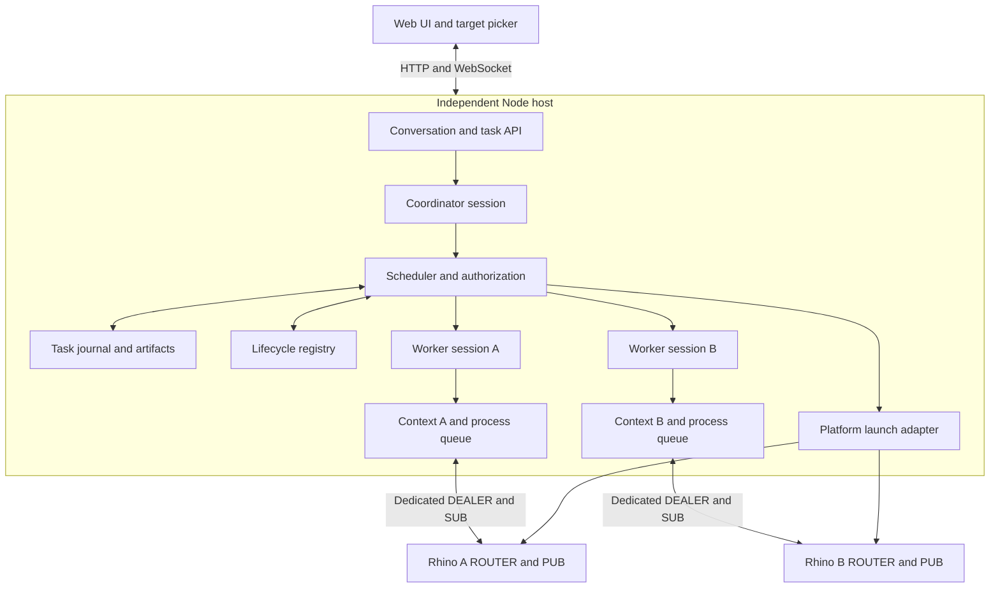

# Shared Hopper host and multiple Rhino instances

Status: implementation and acceptance contract. See [implementation status](shared-host-implementation-status.md) and [platform checks](shared-host-platform-probes.md) for delivered code and observed native results.

Scope correction, 2026-09-09: the user confirmed that macOS should use one Rhino process. Additional Mac targets are document windows created with Rhino `New`, within that process and its shared serial edit queue. The Mac requirements below reflect this correction. First-process Mac launch with zero attachments remains required. Windows retains independent process launch. A Mac document window must never be reported as an independent process.

Build one independent local Node host per OS user, serving one web application. Conversations belong to the host. Each editing task captures its selected documents, and a coordinator can delegate work across Rhino processes. Every Rhino retains its C# plugin and dedicated ZeroMQ connection.

Agent-driven Rhino launch on Windows and macOS, and geometry transfer between targets, are required parts of this plan. They have delivery milestones and acceptance checks below. The project is not complete when attachment and delegation alone ship. Mac launches its first process when none is running; additional Mac targets use Rhino New in that process.

Remote machines, replicated hosts, seamless continuation of interrupted model responses, automatic host upgrades, automatic legacy-history import, automatic hung-host termination, and idle shutdown are outside this delivery. Keep owned-child mode available during rollout, but never let it and shared mode control the same lifecycle simultaneously.

## Terms and target contract

| Term | Meaning |
| --- | --- |
| Host | The Node service for one OS user. Each launch creates a new host epoch. |
| Process | A Rhino OS process, identified by PID and start time. A window is not a process. |
| Lifecycle | One running Hopper plugin lifecycle, identified by `lifecycleInstanceId`. Plugin stop/start creates a new identity. |
| Document | A Rhino or Grasshopper document identified within its lifecycle and kind. Names and paths are labels, not identities. |
| Target binding | One immutable document or associated document pair in one lifecycle, as defined below. |
| Instance context | A lifecycle's RPC client, status subscription, readiness state, and access to its process edit queue. It is not an agent session. |
| Conversation / session | A persisted user conversation / a Pi context and history belonging to that conversation or one child task. |
| Task / turn | A persisted assignment / one execution attempt within that assignment. A continuation creates a new turn. |
| Attachment generation | C#-issued ownership generation that changes on authenticated reattachment and rejects old queued work. |

Use this discriminated binding in host contracts, with equivalent C# validation:

```ts
type TargetBinding =
  | {
      lifecycleInstanceId: string;
      kind: "rhino";
      rhinoDocumentId: string;
    }
  | {
      lifecycleInstanceId: string;
      kind: "grasshopper";
      grasshopperDocumentId: string;
      associatedRhinoDocumentId: string | null;
    };

type ExecutionOwner = {
  taskId: string;
  turnId: string;
  binding: TargetBinding;
  attachmentGeneration: string;
};
```

A Grasshopper binding with an associated Rhino document authorizes tools using that captured pair, including `setParamRhinoGeometry`. Without an association, expose only operations that do not require Rhino context. Selecting a Rhino model alone does not authorize an arbitrary Grasshopper canvas; the picker must show and record any associated document included in the selection. Resolve ambiguous associations before accepting work.

Check both document identities and the association before dispatch and again on the C# execution queue. A changed association stops the affected turn. A new selection or bounded document grant can authorize a new binding; never substitute the currently active canvas or Rhino window. Keep settings revisions and transaction preconditions alongside the execution record and refresh them after known operations without changing the captured identities.

## What happens on screen

`Rhino_A` and `Rhino_B` below mean different OS processes. `Model_1` and `Model_2` mean documents. Display documents beneath distinguishable process labels, such as `Rhino_A / Facade.3dm`.

1. The user runs HopperCode in A. Its plugin discovers or starts the shared host, attaches A, and opens the application. A's current document is selected for the initial task.
2. The user runs HopperCode in B. B attaches to the same host and opens its application URL. Existing conversations remain available; their selections do not automatically expand to B.
3. The user selects one target or several. The composer shows the exact selection captured on submission. Two alternatives on separate processes can run concurrently; documents sharing a process display "Edits run sequentially in this Rhino process".
4. A request to start another Rhino uses the launch flow below, then adds only its verified granted target. A request to transfer geometry produces an inspectable artifact and a separate destination import result.

Picker changes affect subsequent submissions only. General discussion works with no selected target or attached Rhino; geometry requires a selected binding or an explicit document/launch grant. The coordinator can discover targets and start a granted launch without an edit owner. A process with zero documents remains available for a bounded document action.

| User action | Expected behavior |
| --- | --- |
| Quit A while B remains | A's work becomes interrupted or uncertain. B, Node, and the conversation continue, even if A launched Node. |
| Stop HopperCode in A | Detach A and clean up only its scopes. Preserve the shared host and B. |
| Close one Mac document | Invalidate only that target. Keep the process attached for its surviving documents. |
| Close the last Mac model window without quitting the application | If the process and plugin remain alive, keep an attachment with zero documents. Verify this on packaged builds. |
| Windows New/Open replaces the current document | Preserve the connection if the plugin lifecycle survives; invalidate the old document binding. |
| Mac New/Open adds a window | Add a document beneath the same process and queue. Do not present it as independent process execution. |
| Focus another model during a task | Retain the captured document references or stop with a target-change result. |
| Close all Rhinos | Keep the conversation available. The launch milestone lets the host start Rhino with no existing attachment. |
| Close or reload the browser | Accepted tasks continue. Reconnection restores persisted task state. Closing a tab is not cancellation. |
| Cancel Rhino's save/discard/close dialog | Preserve the document and its target. Do not discard modified work implicitly. |

The platform replacement distinction already exists in [DocumentOperations.cs](../dotnet/Hopper.Rhino/Operations/DocumentOperations.cs) and [MacDocumentWindows.cs](../dotnet/Hopper.Rhino/Operations/MacDocumentWindows.cs). Native focus behavior and document lifetimes still require packaged tests.

### Browser ownership and authentication

Keep one controlling browser tab initially, matching `src/host/server.ts`. Opening another authenticated tab transfers control, disconnects the old controller, and shows an explicit reconnect action there. This does not cancel tasks. Several conversations may have background tasks even though one tab controls the application. Multiple simultaneous controlling tabs are deferred.

Persist a dedicated random browser credential in the user-private host control directory. Reuse it across ordinary Node restarts and keep it separate from host epochs, lifecycle connection tokens, and attachment generations. HopperCode opens the stable host URL with this credential in the fragment; retain the existing session-storage behavior and remove the fragment after reading it. Never put credentials in conversation events or target metadata. Credential revocation requires a fresh HopperCode link; ordinary restart does not.

After authenticating, the browser receives a fresh snapshot and event cursor before enabling commands. Snapshots include conversations, accepted tasks, terminal outcomes, and pending questions. Each command names its conversation and task/session where applicable. Persist question IDs and accept the first valid answer atomically; reject stale or repeated answers. A replacement tab replays pending questions without creating new ones.

## Architecture and agent sessions



Keep the C# ROUTER/PUB topology and use one Node DEALER/SUB pair per lifecycle. Do not connect one DEALER to several Rhinos and expect application-level target routing.

For the single-target milestones, execute a request directly in the conversation's target-bound Pi session, without a coordinator model call. Close the previous execution scope before binding a subsequent task. Once delegation ships, the conversation session becomes the coordinator, with target discovery, bounded document actions, launch, transfer scheduling, and `delegate`. It has no unrestricted geometry tools. Root submissions within a conversation queue behind the active root task.

Each delegated task has a separate child Pi session, runtime, history, prompt context, UI requests, and scratch workspace. Bind its geometry tools to one `TargetBinding`. It receives the assignment, selected source material, and artifact references; it does not inherit sibling histories or acquire delegation/process-launch tools. `delegate` accepts a stable child request ID, assignment, authorized binding, source references, and dependencies. Persist and deduplicate before starting its runtime.

Scope `agent_start`, `agent_end`, and `session_shutdown` hooks to the owning session. A coordinator turn cannot open or finish a worker transaction. Replace `sharedRuntime`, `sharedAgentTurnActive`, global alias stores, connection-profile caches, and mutable script/tool state with injected dependencies. Aliases belong to document contexts. Mac document contexts share their process queue and transport owner.

Share immutable metadata and configuration. Keep mutable Pi service objects session-owned unless concurrent use is verified; do not assume `ModelRuntime` is safe to share. Serialize shared credential/configuration writes. Persist model usage per session/turn, derive root totals without double counting, and enforce host worker-concurrency and model-usage budgets before additional work starts. Process-launch grants do not increase those budgets.

Render each child as an expandable entry with its target, state, progress, artifacts, and usage. Events carry conversation, root/parent task, child task, session, turn where applicable, and binding identities, plus an event ID. Full child history remains inspectable. Root cancellation prevents new delegation and requests descendant cancellation while preserving completed results and uncertain outcomes.

### Routing guarantees and script limits

Geometry tool schemas expose no lifecycle override. The injected task facade supplies captured identities and rejects conflicting document arguments. Node checks authorization, task state, attachment generation, and edit ownership; C# repeats execution preconditions. Reads and captures need document validation too. Resolve explicit document references wherever supported; operations requiring activation acquire the process queue, activate and validate, or fail.

These checks constrain RPC routing, not arbitrary Python/C# code running inside Rhino. `rhino-script-validator.ts` currently checks a command-mode denylist; it does not sandbox script bodies. Scripts and Grasshopper components can access other documents or write files outside managed document APIs. Keep these tools available as trusted in-process code, bind their supplied execution context, and document that cross-document isolation and save reservations do not cover arbitrary script side effects. Do not claim a regex or fixed RPC binding prevents those effects.

The coordinator must use managed document/launch/transfer tools for those actions. Audit script entry points and tests for correct default context. Enforcing a sandbox for arbitrary native code would require a separate design and is outside this plan.

Complete the document-routing audit before exposing operations in milestone 3. One attachment can already contain several Mac documents, and users can change native focus even when the browser disables switching. Audit every exposed operation's required documents, active-context dependencies, settings source, and Grasshopper association checks. Bind and validate its context or disable it with an explicit capability result. Repeat these checks across attachments in milestone 4. Current Grasshopper settings read the active Rhino context and report association mismatches; do not treat the association field alone as proof that evaluation uses the captured Rhino document.

## Durable storage and task admission

Use `<dataDir>/shared-host` from the existing OS-user data root. Store the host journal in SQLite, with one Node writer, transactional schema migrations, foreign keys, and durable commits. Select and package the SQLite adapter in milestone 1; validate it against the shipped Node runtime on both platforms before adopting it. Do not build a second JSON journal alongside it.

SQLite supports durable task acceptance, request deduplication, and recovery after host failure. It commits related task, operation, and event records together; Pi history alone cannot establish whether an edit was dispatched or completed. SQLite is an embedded local database file with no separate server to operate. Multiple Rhino connections do not themselves require a database, but an in-memory scheduler would not meet this plan's restart guarantees. Keep durable recovery in scope.

Keep Pi histories in `sessions/<conversationId>/main` and `sessions/<conversationId>/workers/<taskId>`, and scratch files in `workspaces/<taskId>`. The main session role changes from direct execution to coordinator when delegation ships. Retained artifacts live under `artifacts/<artifactId>`, outside scratch cleanup. Never delete referenced artifacts or records needed to resolve uncertain work.

| Record | Minimum fields and constraints |
| --- | --- |
| Conversation/session | IDs, session role, Pi history path, creation time, current event cursor. |
| Submission/task | IDs, root/parent/dependency IDs, assignment and attachment references, immutable initial bindings, state, cancellation intent, timestamps. Unique browser request ID with payload hash and original acceptance result. |
| Turn | Task/session IDs, `ExecutionOwner` for geometry execution, state, usage, start/end times, interruption or cleanup result. Discussion/coordinator turns have no edit owner. |
| Attachment | Lifecycle and PID/start identity, host epoch, C# generation, capabilities, document snapshot, admission state. |
| Operation | Host journal ID, task/turn/owner, operation name/class, immutable arguments and hash, wire operation ID for mutations, deadline, state, terminal result or uncertainty reason. |
| Question/event | Stable ID, conversation/task/session, sequence, payload; answer and consumption state for questions. Persist semantic task transitions with their events. |
| Task input | Request ID and payload hash, command kind, conversation/task/session, target turn for steering, ordered sequence, application state, and acceptance result. |
| Recovery disposition | Operation/task IDs, unresolved outcome, evidence and inspected baseline, user acknowledgement, process/reservation release decisions, timestamp, and deduplicated request ID. Never overwrite the original operation outcome. |
| Grant/reservation | Root task, kind, permitted action/count, lifecycle or installation, path/save policy, request and operation IDs, state; canonical destination identity for reservations. |
| Launch/artifact | Launch correlation and bootstrap state; artifact path, checksum, format, units, provenance, export/import operation references. |

Submission acceptance is one database transaction: deduplicate the browser request, validate authorization, persist the task and any submitted attachments, and record its acceptance event. Publish `message_accepted` only after commit. A retry with the same request and payload returns the original task; a different payload under that ID is a conflict. No model call or mutation starts before acceptance commits. Use the same rule for child assignments and grants.

### Steering and follow-up admission

Route the existing `prompt`, `steer`, and `follow_up` commands through the journal before Pi receives them. All require stable browser request IDs; include command kind, destination IDs, text, attachments, and submitted bindings in the payload hash.

- `prompt` and `follow_up` create root tasks queued within the named conversation. Capture the picker selection at acceptance. Do not use Pi's in-memory follow-up queue as the durable task queue.
- `steer` names the active task, session, and turn. Persist an ordered input for that execution and retain its binding and grants. Steering cannot switch targets or expand authority; such requests need a new submission or the existing bounded-grant flow. Coordinator steering does not silently forward to children.
- Accept steering only for a running, non-cancelling turn. Reject a stale turn, a pending question, or a terminal task with an actionable result. If cancellation or completion wins after acceptance but before delivery, preserve the input as not applied. Never redirect it to the next task.
- Journal delivery intent before handing steering to Pi. After a crash, an input whose application is unknown remains visible as unknown and is not automatically injected into a new execution. Duplicate browser requests return the original receipt and application state.

### Task execution states

Pi history files and SQLite do not share a transaction. Link them by stable task/session IDs, create missing runtimes only for admitted work, and rebuild browser task state from the journal. After a crash, a Pi tool message alone is not evidence that its operation completed. Interrupted model output remains interrupted. Streaming text can be transient; durable semantic events and Pi history provide reconnect state.

| State transition | Admission rule |
| --- | --- |
| Accepted → queued → running | Dependencies are satisfied and the task is not cancelled. Geometry additionally requires a live authorized binding and process ownership before opening an edit scope. |
| Running → awaiting_user | Suspend model execution through the question flow below, finish dispatched native operations, and close the owned scope before releasing the queue. Persist the question. If work cannot stop, show waiting with ownership retained. |
| Awaiting_user → queued | Atomically consume one valid answer and create one fresh queued turn. Reacquire ownership and revalidate documents and settings before execution. |
| Running → completed / failed | Record known operation outcomes and confirmed scope cleanup first. Preserve partial edits and results. |
| Any nonterminal state → cancelling | Stop new dispatches and request cancellation. Mark cancelled only after operations and cleanup are known; otherwise use uncertain. |
| Host/lifecycle loss → interrupted / uncertain | Interrupted means no unresolved dispatched effect remains. Uncertain means an operation or cleanup outcome is unknown. Neither automatically resumes model execution. |

Resolve uncertain operations and cleanup before offering continuation. Permanently unknowable outcomes use the explicit recovery disposition below and require a fresh task rather than continuation. A user-requested continuation of reconciled work starts a new turn after revalidating current authorization and documents. A replacement lifecycle requires a new selection and task, even if it reopened the same file. Descendants with failed or uncertain dependencies cannot start; the coordinator reports partial completion.

### Durable questions and Pi suspension

The current `ask_user` tool awaits a browser promise inside its running Pi tool call. Shared mode must replace this behavior for task questions; replaying a persisted question cannot restore that JavaScript promise after a restart.

1. Persist the question with task/session/turn and Pi tool-call IDs. Return a structured `awaiting_user` tool result containing the question ID, and stop the Pi driver before another model request or sibling tool dispatch. Record any undispatched sibling calls as not executed so history has no dangling tool calls. Already-dispatched operations must settle before scope cleanup. The old execution cannot resume when a browser response arrives.
2. Close the owned edit scopes and persist their actual effects. Record the suspended turn and task transition before releasing process ownership and enabling an answer. If cleanup fails or its result is unknown, retain the block and show the question as waiting for recovery.
3. Accept the first valid answer in a transaction that verifies the question and task are still awaiting an answer, records the answer, consumes the question, and creates one uniquely linked queued turn with its event. Cancellation uses the same state precondition, so a late answer cannot revive cancelled work.
4. The new turn receives the question and answer as explicit continuation context. Preserve the previous tool result as `awaiting_user`; do not invent a completed answer in the old execution. Link history entries by question/turn IDs and reconcile missing entries without adding duplicate answers. Revalidate binding and settings before a new scope opens.

After restart, a committed answer with a turn that has never started remains queued. A turn that may have begun model execution becomes interrupted, or uncertain if effects or cleanup remain unresolved, and cannot automatically resume. Never replay it merely because the answer exists. Persist model-start intent before calling Pi. A crash before suspension finishes also requires scope reconciliation before the question becomes answerable. Authentication prompts retain their separate credential flow and must not store secrets in task input or question history.

Prove the Pi stop boundary, tool-result history, and fresh-turn behavior in milestone 1. If the current SDK cannot stop at this boundary, implement and test a driver adapter before milestone 3; do not release ownership while the old Pi execution can still dispatch tools.

### Storage identity and legacy history

Shared mode rejects `--parent-pid` and `--instance-id`; lifecycle registration happens after host startup. Keep singleton control records under a fixed per-user directory, independent of custom data directories. A custom data directory cannot create a second host.

Under the per-user control lock, first startup records the canonical data directory and a journal identity. Include both identities in the user-private discovery record. Subsequent launches without `--data-dir` use the recorded directory, including replacement hosts after a crash. An explicit different directory is a configuration conflict: show the running/recorded directory and reject attachment or startup without creating another journal. If the recorded directory is missing or inaccessible, block with an actionable error rather than falling back to an empty default directory. Changing storage requires an explicit offline migration/reset procedure outside this delivery; Stop Host and a new invocation do not implicitly change it.

Legacy `instances/*/sessions`, including `instances/standalone/sessions`, remain intact and readable through owned-child mode. Shared mode starts with new conversations. A later explicit import must be versioned, resumable, deduplicated, preserve originals/artifact references, and import no live authorization or pending execution. Automatic import is not a launch requirement. Never call `continueRecent` across unrelated conversation or worker directories.

## Process scheduling and document actions

Provide one edit owner per Rhino process from the first shared-host milestone, covering Rhino and Grasshopper scopes across all its documents and conversations. Hold ownership across an editing scope, including model calls between edits, rather than per RPC. Worker-concurrency limits apply even before multi-target delegation. A human can still edit Rhino, so captured state and transaction checks remain necessary.

Dependency waits happen before ownership acquisition. Workers never hold one process while awaiting a sibling on another. For user questions, follow the scope-closing rule above. Running native operations may be uncancellable; report that state and retain ownership until their outcome and cleanup are reconciled. A timeout is not permission to start the next worker.

### Bounded document creation and opening

The first multi-attachment milestone selects already-open documents. Add create/open grants as a separate required milestone before process launch. The main conversation session can request these host actions before delegation ships; geometry workers cannot switch their binding themselves. Route actions through existing `manageRhinoDocument` and `manageGrasshopperDocument` APIs. List/inspect/save/close remain bound to existing targets.

A document grant records root task, attached lifecycle, document kind, action, result-count limit, request ID, optional validated path/template, and replacement/save policy. "Create another model in A and build option B there" authorizes one creation in A. A lifecycle with zero documents can receive this grant. It does not authorize another lifecycle or arbitrary existing documents.

Use an explicit release/reacquire handoff when a direct conversation turn requests create/open while it owns an editing scope. Never enqueue a second acquisition and await it while retaining the first:

1. Persist the bounded grant and deduplicated pending document action. Stop the old Pi driver at a tool boundary, prevent further model/tool dispatch, settle dispatched operations, and close both owned transaction kinds. Record the tool handoff result and ended turn without marking the root task completed. Confirm cleanup before releasing process ownership. Failed or unknown cleanup blocks the action and retains ownership for recovery.
2. After release, the scheduler queues the document action as a separate, journaled process owner linked to the task, grant/request ID, lifecycle, and attachment generation. This owner can perform only the granted transition and its authorized save handling; it does not require an existing document binding when the lifecycle has zero documents. A coordinator with no edit owner enters here directly. Do not hold another process while waiting for this action.
3. Once ownership is acquired, obtain any required save reservations and revalidate every affected document, active context, and replacement/unsaved policy. Another task or human may have changed the process during the handoff. Commit the grant's in-flight operation before dispatch. Verify the returned document against that live lifecycle, then atomically consume the grant, append the resulting binding to the task's separately recorded authorization additions, and record the action result and one uniquely linked queued continuation turn. Opening an already-open file can authorize only the verified document matching the requested path. Unexpected or uncertain outcomes require reconciliation before retry; never create a duplicate document blindly.
4. Confirm action completion and cleanup before releasing its ownership. The fresh turn acquires ownership normally and revalidates the resulting binding and settings before opening a new scope. It receives the recorded handoff and action result as context. Preserve the old turn's immutable `ExecutionOwner`; never resume its driver or retarget its tools. Cancellation prevents the pending action or continuation from starting, and a late result cannot revive the task. On restart, reconcile the persisted handoff/action before admitting subsequent stages, using the existing never-started versus possibly-started turn rules.

The fresh-turn handoff applies to the suspended direct execution. A coordinator with no edit scope receives the persisted action result in its existing turn and can delegate against the verified authorization addition; do not also create a direct continuation for it.

Include the handoff stages, grant-action ownership, and unique action-to-continuation link in the milestone 5 journal/schema contract. On Windows, replacement invalidates the old binding and requires the recorded save policy. On Mac, an added document shares the process queue. Preserving a Windows model while creating another requires a separate process. Ambiguous destinations and unsaved policies require resolution before dispatch; a general request for a new model does not authorize discarding modified work.

### Shared save destinations

Introduce destination reservations before concurrent work across attached processes. The one-attachment milestone serializes all editing and retains existing native save preflight; it does not need the cross-process reservation machinery yet.

Reservations cover Hopper-managed Rhino and Grasshopper saves, implicit saves during document actions, and managed artifact exports. Acquire process ownership first, then reserve the operation's full destination set together in canonical-path order. Resolve filesystem case behavior, parent-directory aliases for new files, and existing file identities where supported. Keep this policy aligned with C# validation; reject ambiguous identity or an undisclosed destination before writing.

Persist reservations before dispatch. After acquisition, revalidate existence, overwrite permission, file baseline, and known open documents across attachments; C# repeats preflight at execution. Waiting for another writer never grants overwrite permission for the file it created.

Hold reservations until confirmed completion. Restore unresolved reservations before save admission after restart. Timeout, cancellation, or disconnect does not release a potentially running write. Reconcile its operation and destination before release. Human saves, other applications, and arbitrary script writes remain outside this coordination; retain external file-change checks and report conflicts without promising filesystem-wide exclusivity.

If completion evidence is permanently unavailable, release requires the explicit recovery disposition below, including proof the old writer cannot continue and a newly inspected file baseline. Acknowledgement alone never releases a potentially running write.

## Shared startup, ownership, and recovery

Detach Node from the launching Rhino's parent PID, redirected output lifetime, and child-tree cleanup. Plugins keep their transport alive across host outages so a replacement can authenticate and reattach without resetting the Rhino lifecycle.

Prototype exclusive binding of a stable per-user loopback endpoint as lifetime ownership. It must remain exclusive while hung, release on exit, and coexist with other OS users. Serialize first endpoint assignment under a per-user control lock; persist it outside any custom data directory. Competing candidates for one user never fall back to different ports. If endpoint binding cannot establish the required exclusivity on both platforms, add a per-user OS lifetime lock. A PID file or existence check alone is insufficient.

The candidate holding ownership reads startup intent and the pinned storage identity, restores that journal, then atomically publishes a user-private discovery record containing endpoint, PID/start identity, host epoch, canonical data directory, journal identity, protocol/schema compatibility, and registration authentication material. Restrict file access to the OS user on both platforms. Validate host and storage identity before plugin registration. If an unrelated process occupies the assigned endpoint, report the conflict; do not connect as a plugin, terminate it, or choose a competing fallback host.

Reuse compatible hosts according to declared protocol/capability and storage-schema ranges. An incompatible plugin cannot register or replace the host automatically. Show both versions and the action needed to stop/update/restart explicitly. Preserve existing attachments and tasks. Automatic drain-and-upgrade handoff is deferred.

Enabled plugins retry discovery/start with bounded backoff while desired state is running. A confirmed host exit allows one replacement to acquire ownership. Without an enabled plugin, the next explicit HopperCode invocation starts it; a supervisor independent of Rhino is deferred. A hung host retains ownership. Show blocked recovery and an explicit restart instruction; do not automatically terminate it or steal its lock. Sleep/wake and heartbeat loss indicate unknown availability, not process exit.

### Intentional stop

The application has a distinct Stop Host action. Under the short-lived per-user control lock, persist `desiredState: stopped` and a monotonically increasing revision before shutdown. Reject new tasks, cancel/drain accepted work, and persist unresolved outcomes. Notify plugins; disconnected plugins read the durable record before every retry. Launch candidates recheck its revision after obtaining lifetime ownership and before publication.

Only explicit HopperCode invocation changes intent back to running. Serialize this with draining shutdown so a stale stop cannot overwrite a newer start. Background initialization, browser reload, and queued retries do not change intent. Missing initial state permits first startup; corrupt existing state blocks automatic launch with an actionable error. Stopping one plugin does not change host intent. Keep the host running when idle; automatic idle shutdown is deferred.

### Operation journal and reconciliation

Use `classifyOperation` in `src/protocol/v2.ts` as the basis of an exhaustive policy table. Routing ownership in `runtime-rpc-ownership.test.ts` is a different concern. The policy must identify required binding, dispatch journal, and recovery strategy for every operation; new operations fail the policy check until classified.

For mutations, allocate the wire `operationId` in the host, persist immutable intent and owner in a durable commit, then pass that ID into `RpcClient.call`. Do not let the transport generate an unjournaled ID on this path. Persist terminal results before reporting completion. A crash between intent and send is indistinguishable from a lost reply without C# evidence, so a missing result is uncertain, not permission to replay.

Keep the existing operation-ID rule for controls: `RpcClient` and C# reject `operationId` on non-mutations. Extend handshake/ownership fields as needed for shared attachments, and record side-effecting controls under a host-only journal ID:

| Operation class/control | Recovery rule |
| --- | --- |
| Ordinary read-only queries | No durable dispatch journal; still validate document binding. |
| Mutation | Query retained result by wire operation ID in the same lifecycle; observe pending work, persist terminal results, or mark uncertain when evidence is missing. |
| `startGrasshopper` | Reconcile the desired postcondition through live runtime/capability status. Ready means the requested state is satisfied, not proof which call caused it. Starting/unavailable status does not prove cancellation or failure; block dependent work until resolved. |
| `cancelOperation` | Record the mutation ID being cancelled; reconcile that mutation's retained result. Acknowledging the cancel request does not prove the mutation stopped. |
| `lifecycleHandshake` | Persist the C#-issued attachment generation and status; reconcile ownership through an authenticated handshake/status exchange, not a mutation lookup. |

The current `MutationResultStore` defaults to 256 results, 16 MiB, and a ten-minute terminal TTL. Preserve bounded retention and test expiry explicitly. Long sleep or host downtime can leave a completed operation uncertain after evidence expires. Do not describe recovery as exactly-once execution or automatically replay missing records.

### Recovery when the outcome cannot be established

Keep historical outcome and permission to do new work separate. The UI offers inspection and an explicit acknowledgement for permanently unknown effects, with affected documents/files, retained evidence, and any partial result. This does not mark the operation completed, failed, cancelled, or rolled back.

- Before releasing process ownership, authenticate the current attachment, fence old queued requests, and confirm no old operation is running and both transaction kinds are idle after any required cleanup. Alternatively, verified exit of the original PID/start identity proves that process cannot continue; a replacement lifecycle still needs a new selection. Missing evidence of idleness or exit keeps the process blocked and requires manual recovery.
- Before releasing a save reservation, prove the original writer cannot continue, inspect the destination's current identity and contents or absence, and record a fresh baseline plus acknowledgement. A later save must obtain a new reservation and fresh overwrite authorization. Do not infer that the unknown write succeeded.
- Atomically persist a deduplicated recovery disposition, its evidence, and any permitted release decisions. A restart must neither forget the release nor repeat an old operation. Keep the original task uncertain with an acknowledged disposition; it cannot satisfy successful dependency checks.
- Once these checks pass, the user can submit a fresh task against the inspected state with fresh authorization. Preserve the old task, artifacts, and unknown result. Any corrective edit or repeated import is a separately authorized action, never an automatic retry.

Apply the same distinction to uncertain launches: reconcile or explicitly account for the original candidate before permitting a new launch grant. A still-ambiguous or potentially pending launch remains blocked. User acknowledgement cannot bypass unknown running work.

### Transaction reconciliation on every attachment

Close edit admission for the whole process before initial attachment or reattachment. Rotate C# ownership generation and reject old queued work at execution time. Already-running work may finish; observe it before cleanup. Inspect both Rhino and Grasshopper transaction state even when every journaled RPC is terminal. Successful RPCs do not prove an undo scope ended.

Persist `ExecutionOwner` before opening a scope, and require matching ownership for begin/edit/finish. `RhinoAgentTransaction.Begin` currently accepts an active same-document scope without task ownership; extend that behavior rather than treating document identity as sufficient. Preserve the existing lifecycle cleanup protection while separating transport lifetime from host lifetime.

Provide an authenticated recovery operation that validates the old owner and expected scope under the new attachment generation and can only close that scope. It cannot adopt it or dispatch edits. After cleanup, record the actual effect, query both transaction states again, and leave the interrupted task visible. Missing ownership metadata, failed cleanup, unknown running work, or unavailable status keeps the process blocked. A continuation uses a new turn after these checks; in-place ownership adoption is deferred.

Rhino cancellation closes the undo record without reversing edits. Grasshopper cleanup may restore a snapshot. Show the actual result rather than labelling both rollback. Recovery restores conversation and known outcomes; it cannot recover unsaved geometry lost in a Rhino crash. Apply these checks after transient transport loss and sleep/wake even if the host epoch is unchanged.

## Required Rhino launch

"Open another Rhino and explore option B there" records a bounded launch grant. The host starts the application through a platform adapter, waits for authenticated Hopper registration and document readiness, then schedules the child. The UI shows `Starting Rhino`, `Connecting Hopper`, and `Ready`, or an explicit waiting/failure/uncertainty state. Launch works with zero attached Rhinos.

### Barkcode reference and platform adapter

Use Barkcode as a source reference, inspected at commit `32e2d031fe2b9d1718b951a2f65edeba0415f59c`. Adapt its platform launch, CLI discovery, and readiness polling to Node's `child_process` API; do not introduce Bun as a runtime dependency.

| Platform/reference | Observed pattern and Hopper application |
| --- | --- |
| Windows | Barkcode starts the installed `Rhino.exe` with `/nosplash` and a `/runscript` argument that starts the script server. Resolve the installation and validate argument quoting with Node. [Platform source](https://github.com/tsoumdoa/barkcode/blob/32e2d031fe2b9d1718b951a2f65edeba0415f59c/src/lib/rhino-platform.ts). |
| macOS | Barkcode invokes `/usr/bin/open` with the app bundle and `--args -nosplash`, and resolves bundled `rhinocode` when PATH lacks it. Its configuration caps instances at one. This supports a first-process launch pattern, not proof of independent additional processes. [Platform source](https://github.com/tsoumdoa/barkcode/blob/32e2d031fe2b9d1718b951a2f65edeba0415f59c/src/lib/rhino-platform.ts). |
| Discovery/bootstrap | Poll `rhinocode list --json`, validate its output, and use `--rhino <pipeId> command <bootstrap-command>` for a specific candidate. Barkcode separates discovery from command execution. [CLI source](https://github.com/tsoumdoa/barkcode/blob/32e2d031fe2b9d1718b951a2f65edeba0415f59c/src/lib/rhinocode.ts), [discovery source](https://github.com/tsoumdoa/barkcode/blob/32e2d031fe2b9d1718b951a2f65edeba0415f59c/src/lib/rhinocode-schemas.ts). |
| Process identity | The PID returned by `open` is not Rhino's PID. Barkcode does not treat its Mac PID snapshot as proof of ownership. Hopper requires correlated registration and PID/start verification. [Session source](https://github.com/tsoumdoa/barkcode/blob/32e2d031fe2b9d1718b951a2f65edeba0415f59c/src/lib/rhino.ts). |

Use `spawn`/`execFile` with structured arguments and no shell interpolation. Resolve installation IDs and executable paths inside the host. Validate Rhino macro argument escaping separately from shell escaping. Use detached launch and ignored/file-backed stdio as appropriate so Rhino survives host exit; prove the actual behavior in packaged tests. Never use CLI broadcasts for bootstrap or geometry work.

The `rhinocode` path is an internal launch/bootstrap option. Once Hopper registers, all geometry operations use the bound ZeroMQ route and journal. Do not add an unrestricted agent CLI tool that bypasses scheduling. Validate script-server startup on Mac; a successful `open` exit alone does not establish CLI or Hopper readiness.

Validate first-process Mac launch, plugin bootstrap, license dialogs, and authenticated document readiness. Create additional Mac targets through a bounded Rhino New command in the existing lifecycle. Verify that the original document stays open, the new document has a distinct identity, and both share one process edit queue. Reject requests for an additional independent Mac process with this capability explanation.

### Launch tools and persisted flow

| Host tool | Contract |
| --- | --- |
| `listRhinoTargets` | Process identities, document bindings, readiness, validated installations, and separate capabilities for first-process launch, additional process launch, and additional document creation. |
| `launchRhinoInstance` | Request ID, validated installation ID, optional model/template path, label, and root launch grant. Returns a launch record, then the authenticated lifecycle and granted ready target. No arbitrary executable or shell command argument. |
| Existing document management | Create/open in an already-attached lifecycle using the document grant. Does not imply process launch. |

1. Persist a launch grant and request before spawning. An explicit user request authorizes its bounded count without another confirmation; automatic expansion uses a user-enabled additional-process budget, default zero. Child workers cannot increase it.
2. Record the pre-launch process snapshot and dispatch intent. Create a single-use nonce in a user-private bootstrap ticket, scoped to the launch request, installation, expiry, and expected process identity once known. Pass an opaque ticket reference through a tested startup/bootstrap mechanism. Do not log credentials.
3. Discover the candidate and invoke the fixed Hopper bootstrap without opening another browser tab. Correlate its registration to the ticket and verify lifecycle, PID/start identity, plugin compatibility, and desired host state. CLI discovery alone never attaches or authorizes an unrelated existing Rhino. If correlation is ambiguous, stop for reconciliation rather than choosing the first new pipe.
4. Await the granted document. A zero-document lifecycle uses the launch request's explicit bounded document grant. Atomically consume the grant and record the resulting binding before a child can edit it. Registration does not authorize every document in the process.
5. Persist terminal launch state. Known startup errors fail; identifiable startup/license dialogs produce `awaiting_user`; ambiguous timeout produces `uncertain`. A retry or host restart reconciles the existing ticket/process/registration before any further spawn. Never replay an uncertain launch.

Cancellation stops assignment and bootstrap work where possible; late registration cannot revive a cancelled task. Keep launched Rhinos and their unsaved models open after completion or cancellation. Do not copy batch-processing cleanup that quits applications after a job. Intentional host shutdown remains authoritative even when bootstrap or retry races with it.

## Required geometry transfer

Start with selected Rhino geometry exported to a native `.3dm` artifact and imported into the destination Rhino document. Use this as the first supported format; add other formats only with their own round-trip checks. Grasshopper results must first be materialized into an authorized Rhino document through an explicit operation. Transfer of live Grasshopper definitions or arbitrary external dependencies is outside the initial transfer contract.

Expose host-coordinated export/import operations with artifact IDs, not mutable worker paths. Resolve source object IDs within the source binding; GUIDs and aliases cannot identify destination geometry. The artifact manifest contains source lifecycle/document and export operation, selected-object provenance, format/version, byte length, checksum, model units/tolerance, and creation time. Record supported object types and reject unsupported objects or unresolved dependencies rather than silently dropping them.

1. Acquire source process ownership, validate selected geometry and units, and journal export to a reserved staging path. Export must not change the source document's save path or replace it. Release source ownership after confirmed export completion.
2. Verify the completed file and manifest, then publish to an immutable artifact location. Commit its reference before scheduling import. Reconcile a crash between file publication and journal commit by artifact ID and checksum; existence alone is not export success.
3. Acquire destination ownership only after publication. Validate destination binding, units, and settings revision. Default to converting coordinates to preserve physical dimensions using recorded source/destination units. Unknown/custom units require an explicit conversion factor; do not change destination model units implicitly.
4. Journal one import mutation in a destination-owned transaction. Return destination object IDs and any supported provenance mapping, with explicit layer/name conflict behavior. Initial policy creates a transfer-specific layer namespace and new destination object identities; it does not overwrite existing objects by source GUID.
5. Persist the result and artifact references. Failed or uncertain import preserves the source artifact and reports partial completion. Reconcile before retry; do not import another copy blindly. Compensation is a separate authorized edit with verified preconditions.

Export and import may target different documents in one Mac process; they still run sequentially and release source ownership before acquiring destination ownership. There is no atomic transaction across processes. Reservations cover managed output files, and artifact cleanup must respect conversation references and unresolved imports.

## Code changes and delivery

| Area | Implementation starting point |
| --- | --- |
| Runtime/session isolation | `src/infra/runtime-rpc.ts`, `src/infra/connection.ts`, `src/services/guid-shortener.ts`, script services, and `src/index.ts` turn hooks. |
| Shared host, journal, and browser | `src/host/index.ts`, `config.ts`, `lifecycle.ts`, `pi-runtime.ts`, `server.ts`, `protocol.ts`, `web-ui-context.ts`; `src/extensions/choices/`; `web/src/hooks/use-hopper-connection.ts` and `web/src/state/`. Include durable steering, question suspension, and recovery disposition UI. |
| Native lifetime and reattachment | `dotnet/Hopper.Rhino/RhinoProcessAdapters.cs`, Rhino composition, `dotnet/Hopper.Core/Lifecycle/LifecycleController.cs`, and `Transport/RpcTransportOwner.cs`. |
| Document/transaction checks | Rhino and Grasshopper executors/transactions, `Operations/DocumentContracts.cs`, document operations, and `DocumentService.PreflightSave`. |
| New host services | Lifecycle registry, process scheduler, SQLite journal, grant/reservation services, platform launcher, and artifact transfer service. Keep platform launch dependencies injectable for tests. |

| Milestone | Deliverable and gate |
| --- | --- |
| 1. Isolate runtime state | Inject binding/task/session contexts in owned-child mode. Preserve existing single-instance behavior. Finalize journal schemas, task/input transitions, recovery dispositions, and the packaged SQLite adapter. Prove Pi question suspension and fresh-turn history before shared execution. |
| 2. Prove platform lifetime and launch | Prototype singleton endpoint/control locking, pinned storage identity, detached Node lifetime, reattachment, browser credential persistence, Windows launch/bootstrap, Mac first/additional process launch, and sleep/wake. Record supported builds and unresolved blockers. This can proceed alongside milestone 1. |
| 3. Shared host with one attachment | Behind a flag, serve conversations with zero or one attached Rhino, durable prompt/steer/follow-up admission, question suspension, process ownership, browser takeover/reconnect, intentional stop, and transaction recovery including acknowledged unknown outcomes. Complete the exposed-operation document audit and native focus/association tests. Serialize all edits and reject unsupported routing. No history import or automatic upgrades. |
| 4. Multiple attachments, one selected binding per task | Add registry/picker grouped by process, extend validated document routing across attachments, instance-only stop, cross-conversation scheduling, and save reservations before concurrent writers. Select already-open documents. |
| 5. Bounded document actions | Add new/open grants, verified authorization additions, zero-document handling, replacement/save policy, and new execution contexts after transitions. |
| 6. Multi-target delegation | Add coordinator/child sessions, persisted delegation and dependencies, child progress/questions/cancellation, budgets, and combined text/capture/measurement results. Reuse existing process ownership and recovery. |
| 7. Agent-driven Rhino launch | Integrate the validated platform adapters, grants, bootstrap tickets, readiness, cancellation, and recovery. Launch must work with zero attachments. A missing required platform capability remains a tracked blocker. |
| 8. Geometry transfer | Ship `.3dm` artifact export/publication/import, unit conversion, destination identities, and partial-failure recovery. Validate native round trips on both platforms. |

Milestones 7 and 8 are required for completion. Interim releases do not remove them from scope. Keep one acceptance suite grouped by milestone below; extend it when a prototype resolves a platform decision.

### Decisions and prototype results required before shipping

The binding, single-controller policy, persistent browser credential, SQLite journal, and recovery interruption policy are selected above. The remaining work is to turn them into checked contracts:

- Milestone 1: check in TS/C# request schemas and operation policy, SQL migrations and uniqueness constraints, task-input and question/answer transitions, recovery disposition preconditions, payload/attachment retention rules, and the storage adapter packaging result. Verify the Pi suspension boundary and history behavior with the shipped SDK.
- Milestone 2: record the selected per-user lock/endpoint allocation and storage pinning, Windows and Mac file-access protection, detached process behavior, bootstrap ticket delivery, CLI discovery correlation, and supported launch capabilities. Barkcode supplies a pattern, not Hopper runtime test evidence.
- Before milestone 3: audit every exposed operation's document requirements, active-document dependencies, and Grasshopper association behavior. Validate native focus changes with one attachment, queue ownership across conversations, and known limits for native scripts. Unsupported operations remain disabled.
- Before milestone 4: extend the document-routing and ownership checks across attachments, and verify reservation recovery and explicit release after permanently unknown writes.
- Before milestone 8: validate the concrete `.3dm` export/import adapter, supported geometry/dependency set, unit conversions, and layer/provenance policy with fixtures.

## Acceptance checks by milestone

Use multiple fake C# endpoints and injected process/clock adapters for deterministic routing and crash tests. Then run packaged-plugin smoke tests on Windows and macOS. Mocks cannot establish detached lifetime, licensing, Mac New document behavior, UI-thread document behavior, or native transfer fidelity.

| Milestone | Scenario | Required result |
| --- | --- | --- |
| 1 | Two injected sessions use aliases, scripts, and turn hooks | No shared mutable state or cross-session begin/finish/cancel. Existing owned-child tests pass. |
| 1, 3 | Task asks a question after edits, including a tool batch | Persist an awaiting-user tool result, prevent subsequent model/tool dispatch, settle in-flight work, and confirm scope cleanup before releasing ownership or enabling an answer. A later answer starts a fresh turn. |
| 1, 3 | Crash before/after task commit, acknowledgement, and RPC send | Uncommitted work never dispatches; retried acceptance returns one task; missing mutation evidence remains uncertain. |
| 1, 3 | Duplicate request with changed payload | Conflict without creating or executing another task. |
| 1, 3 | Side-effecting controls lose their replies | Host-only control records reconcile through their defined postconditions; no invalid wire operation IDs. |
| 2, 3 | A and B request startup simultaneously | One host wins ownership. In one-attachment mode the other gets an explicit capacity result; in multi-attachment mode both register. |
| 2, 3 | Launching Rhino exits; Node exits; Node hangs | Rhino exit preserves Node; Node exit permits one replacement; a hung owner blocks competing hosts and reports manual recovery. |
| 2, 3 | Different users or custom data directories start Hopper | One host per OS user, separate endpoints/credentials; custom storage cannot bypass singleton ownership. |
| 2, 3 | Host uses directory X; invocation requests Y; replacement starts without a directory argument | Explicit Y conflicts without attachment or a second journal. Replacement uses pinned X and verifies journal identity. Missing/inaccessible X blocks rather than creating empty history. |
| 2, 3 | An unrelated process owns the endpoint | Clear conflict; no plugin registration, process termination, or fallback host. |
| 2, 3 | Compatible or incompatible plugin discovers existing host | Compatible attaches; incompatible reports versions/action and preserves the host. No automatic upgrade. |
| 3 | Node restart with the browser open | Persistent browser credential authenticates; fresh snapshot/cursor restores tasks before edits are enabled. |
| 3 | No Rhino is attached or no target is selected | Discussion remains available; geometry requires selection or an applicable grant. |
| 3 | New tab takes control; repeated question answer or prompt arrives | Old tab yields without cancelling work; accepted tasks and answers are deduplicated. |
| 3 | Crash during question suspension or before/after answer commit and consumption | Reconcile cleanup before answering; retain one question and at most one answer-linked turn. Never-started turns remain queued; possibly started turns are interrupted or uncertain according to operation/cleanup evidence. History contains no invented or duplicate answer. |
| 3 | Answer races with cancellation, or cleanup is uncertain | One state transition wins atomically; late answers cannot revive tasks. No new execution or queue release while cleanup remains unresolved. |
| 3 | Steer/follow-up retries, picker changes, or crash during input delivery | Deduplicate all commands. Steering retains the named turn's authority; follow-up captures a new queued binding. Unknown steering delivery is visible and never replayed into another turn. |
| 3 | Steering races with completion/cancellation or targets a pending question | Reject stale admission; accepted but undelivered input is recorded as not applied. No redirection to the next task or implicit forwarding to children. |
| 3 | Intentional stop races with disconnected retries or a new explicit start | Durable revision suppresses old retries; one explicit start can restore running intent without stale overwrite. |
| 3, 4 | Node dies between successful edits with an open scope | Every attachment checks both transaction kinds; new edits remain blocked until cleanup is confirmed. |
| 3, 4 | Delayed old requests, failed cleanup, or unknown running work | Reject stale queued ownership; observe running work; unresolved process remains blocked. |
| 3, 4 | Mutation evidence expires during sleep/downtime | Show uncertainty without blind replay or claiming rollback. |
| 3, 4 | Permanently unknown edit is inspected and acknowledged, then host restarts | Preserve unknown outcome and disposition. Release process only after fencing and verified idle/cleanup or original process exit. A fresh authorized task can run; old dependencies remain unsatisfied and no operation replays. |
| 4 | Picker changes while A runs, or another conversation targets A | Existing binding stays fixed; same-process scopes never interleave. Different processes can progress concurrently. |
| 3, 4 | Rhino/Grasshopper association or active window changes, including several documents in one attachment | Pair-dependent tools retain validated identities and settings context or fail before operating on another document. Disabling browser switching does not substitute for native validation. |
| 4 | Mac closes one/last window; Windows replaces a document | Only invalidated bindings stop; surviving process attachments remain, including zero-document state where supported. |
| 3, 4 | Conflicting target arguments or scripts with different default context | RPC overrides are rejected; script default context is bound. Tests do not claim arbitrary script sandboxing. |
| 4 | Two processes save to one new path, including aliases/implicit saves | One reservation wins; the next writer revalidates and cannot infer overwrite permission. |
| 4 | Crash, timeout, or external file change during a reserved write | Reservation survives until resolution; external conflict/uncertainty is reported. |
| 4 | Save evidence expires; user acknowledges uncertainty | A running or unobservable writer stays blocked. Verified inability to continue plus inspected destination baseline permits a durable release disposition; a new save needs fresh reservation and overwrite authorization. |
| 5 | Create/open then edit, including zero documents or already-open path | Consume one bounded grant and bind only the verified resulting document/pair. |
| 5 | Before delegation, a direct turn edits A then requests create/open in the same process while another task is queued | Stop old dispatch, settle operations and close both scopes before release; schedule the action after release without self-wait; revalidate any intervening changes. Start one fresh bound turn only after the action completes and releases ownership. Preserve the old owner and history. |
| 5 | Crash/cancellation during scope handoff, document action, or continuation admission | Uncertain cleanup blocks the action; reconcile committed stages without duplicate create/open or continuation. Cancellation prevents subsequent stages and late results cannot revive the task. |
| 5 | Crash after creation but before recording authorization; user cancels closure | No duplicate creation or unauthorized target; cancelled closure preserves modified model. |
| 3, 4, 6 | Task asks a question or is cancelled with a native operation running | Scope is closed before queue release, or ownership remains visibly held until outcome/cleanup is known. |
| 6 | Coordinator and children run with one failed/uncertain dependency | Session events, questions, and usage remain attributable; dependent edits wait; completed siblings remain visible. |
| 6 | Root cancellation, budget exhaustion, or browser reload | Stop new delegation, enforce limits, restore child entries without duplication, and preserve partial results. |
| 7 | JS launches Windows Rhino and first Mac Rhino with zero attachments | Targeted bootstrap authenticates and reaches document readiness without opening another Hopper tab. |
| 2, 7 | JS requests another Mac target | Execute Rhino New in the selected lifecycle, preserve the first document, and verify two document identities sharing one serial process queue. Reject additional independent-process requests. |
| 7 | Missing CLI, spaces in paths, license/startup dialog, ambiguous candidate | Actionable failure/waiting/uncertainty; no unrelated instance is selected or authorized. |
| 7 | Launch timeout/restart/cancellation followed by delayed registration | Reconcile before another spawn; cancelled task gains no authority; leave Rhino and unsaved models open. |
| 7 | Bootstrap races with intentional stop or worker exceeds its grant | Preserve stopped intent; reject unauthorized launch/target additions. |
| 8 | Round-trip supported geometry with differing units | Preserve physical dimensions within the declared tolerance and return new destination identities. |
| 8 | Unsupported object/dependency, unknown units, stale target, or path conflict | Fail before unsafe import/write and retain any valid source artifact. |
| 8 | Export publishes before crash; import fails or its reply is lost | Reconcile artifact ID/checksum and operation evidence; preserve artifact and partial outcome without duplicate import. |
| 8 | Transfer between two Mac documents in one process | Sequential export/import ownership without waiting on itself or changing the source model's save path. |

Keep legacy originals available throughout rollout. No milestone may be marked complete solely from mocks where its acceptance result depends on packaged Rhino behavior.
